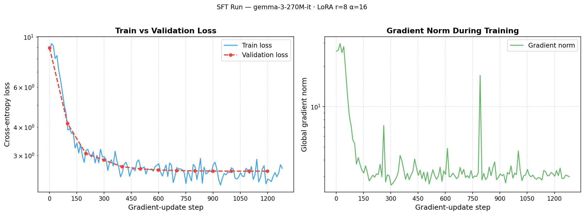
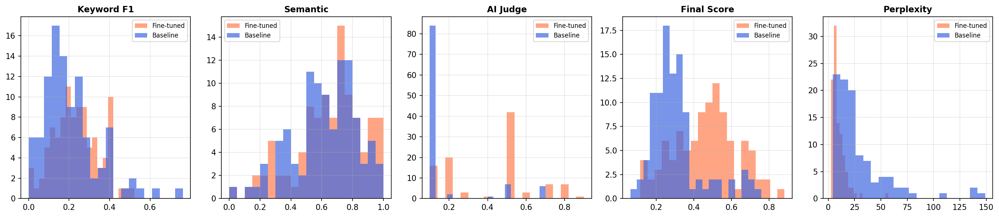

# Tunix-Med: Domain Adaptation of Gemma 3 for Cardiology Assistant

This project demonstrates a complete pipeline for adapting **Google Gemma 3 270M** to the medical domain (specifically Cardiology) using **Tunix**, a high-performance JAX-based fine-tuning library. By leveraging JAX/XLA, we achieve high-speed training that is hardware-agnostic, running efficiently on both NVIDIA GPUs and Google TPUs.

## Pipeline Overview

The project is structured into four main phases, each documented in its own notebook:

1.  **[Building the Medical Mind](01_medical_synthetic_data.ipynb)**: Creating a high-quality synthetic cardiology dataset by distilling knowledge from Wikipedia using **vLLM** and a "Teacher-Judge" curation pattern.
2.  **[Establishing the Baseline](02_baseline_evaluation.ipynb)**: Measuring the raw medical knowledge of the base Gemma 3 270M model across multiple rigorous metrics.
3.  **[Supervised Fine-Tuning](03_tunix_sft_training.ipynb)**: Training a specialized LoRA adapter at "warp speed" using **JAX**, **Tunix**, and a custom implementation of **Einsum-aware LoRA**.
4.  **[Validation & Proof of Knowledge](04_final_evaluation.ipynb)**: Proving the success of domain adaptation through a multi-metric comparison against the baseline.

## Technical Stack

*   **Model**: [Gemma 3 270M-it](https://huggingface.co/google/gemma-3-270m-it) (Experimental small-scale contrast).
*   **Training Framework**: [Tunix](https://github.com/google/tunix) built on **JAX/XLA**.
*   **Inference Engine**: **vLLM** with PagedAttention for high-throughput data generation.
*   **Optimization**: LoRA (Low-Rank Adaptation) including custom layers for **Einsum** operations.
*   **Evaluation**: Multi-pillar strategy (Perplexity, TF-IDF Keyword F1, SBERT Semantic Similarity, and a redefined strict AI Judge).

## Results Summary: The "Workshop Delta"

By fine-tuning with Tunix, we transformed a general-purpose model into a reliable cardiology assistant. The following results were achieved on a held-out test set:

| Metric | Baseline (Pre-SFT) | Final (Post-SFT) | Delta |
| :--- | :---: | :---: | :---: |
| **Perplexity** | 29.4 | **9.8** | **-66.7%** |
| **Mean AI Judge Score** | 0.169 | **0.423** | **+150.3%** |
| **Mean Final Score** | 0.308 | **0.503** | **+63.3%** |

### Key Improvements:
*   **Factual Accuracy**: The **AI Judge (Qwen 2.5 7B)** confirmed a massive jump in clinical factuality, with the model moving from conversational "fluff" to clinically precise protocols.
*   **Certainty**: A **-66% drop in Perplexity** proves the model has successfully internalized cardiology concepts.
*   **Professional Persona**: Post-SFT, the model shed chatbot niceties in favor of a direct, professional clinical tone.

## Visualizing Progress

### Training Stability
The training process was highly efficient and stable, managed by an Optax schedule with warmup and cosine decay.



### Performance Distribution
The shift in metric distributions shows a consistent improvement across all evaluation dimensions.



## Getting Started

1.  **Install Dependencies**: Run the provided installation script.
    ```bash
    bash install.sh
    ```
2.  **Environment Setup**: Activate the virtual environment.
    ```bash
    source .venv/bin/activate
    ```
3.  **Hardware Toggle**: In `03_tunix_sft_training.ipynb`, set `USE_TPU = True` if running on Google Cloud TPUs.

## Conclusion

This project proves that domain adaptation doesn't require massive clusters of GPUs. With the right tools—**JAX**, **Tunix**, and **vLLM**—even a 270M parameter model can be transformed into a high-performance specialist.

#TPUSprint #Gemma3 #JAX
